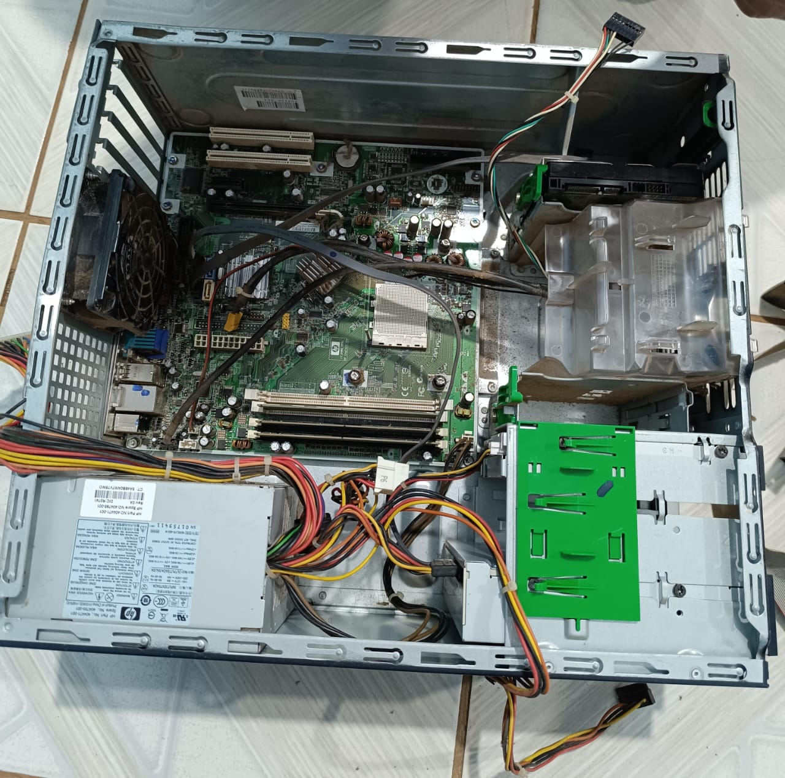

# Relatórios Manutenção e Montagem de computadores 
## Aula 04 
### Maria Clara  
 

|periferico  |possui   |expecificações 
-------------|---------|----------
Gabinete     |         |
Processador  |sim AMD  |Familia ATHLON
Fonte        |SIM      |Fonte liga desliga sozinho
RAM          |SIM      |2GB
Armazenamento|SIM      |40 GB
HD           |SIM      |256 MB
Placa Mae    |SIM 

